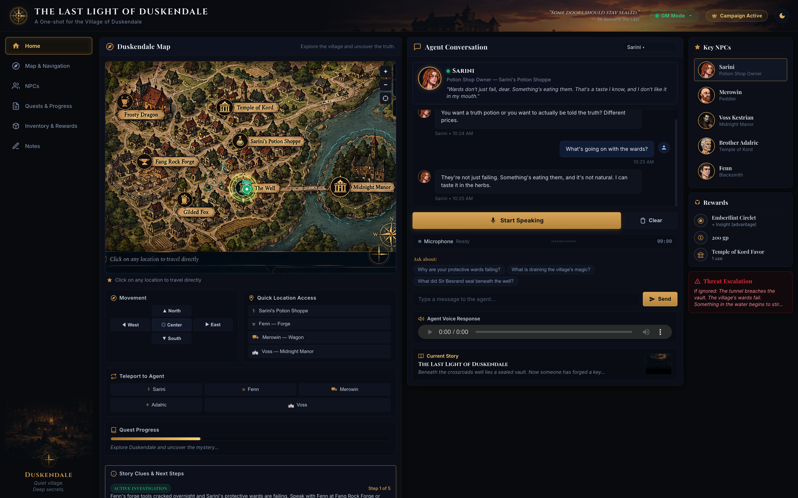

# Village Tales: AI Personification Simulator
A tale's of multiple different AI agents that has been prompted to follow a particular story, each has their own backstory and character vibe, Find what happened in the village years ago and why village is in danger.

## Map

## Story Overview
Decades ago, Sir Besrand the Last sealed an ancient vault beneath the crossroads well after an unknown entity drained the magic from Duskendale overnight. Sir Besrand forbade anyone from forging a key to that vault, but decades later, the mysterious newcomer Voss Kestrian has purchased Midnight Manor and covertly begun tunneling beneath the lake into the vault. As subterranean corruption leaks into the water table, blacksmith Fenn notices his finest steel rusting overnight and alchemist Sarini discovers her protective wards failing, prompting the player to investigate the villagers' warnings, uncover Voss's tunnel, and decide the fate of Duskendale.

## Live Demo
project link: https://village-tales.vercel.app/

## Overview
- Built a lightweight multi-agent personification simulator using LangGraph, Google Gemini, and ChromaDB to power autonomous village characters with persistent memory and multimodal voice interactions.

## Characters and Avatars

### Sarini — Potion Shop Owner

- Role: Alchemist and wardkeeper at Sarini's Potion Shoppe.
- Background: Guarded and precise practitioner who monitors the fading village wards and warns that an ancient presence beneath the village is actively consuming protective magic.

### Fenn — Master Blacksmith

- Role: Craftsman at Fang Rock Forge.
- Background: Terse and superstitious artisan who was the first to detect subterranean corruption when his best tempered steel unnaturally rusted overnight.

### Merowin — Traveling Peddler

- Role: Merchant stationed on the Eastern Road.
- Background: Talkative trader offering regional maps and curios who unwittingly acts as an oblivious delivery courier for Voss Kestrian's smuggled excavation supplies.

### Brother Adalric — Priest of Kord

- Role: Priest at the Temple of Kord.
- Background: Direct and physical leader across the eastern river who tests visitors through action and warns of spiritual rot spreading through village ground.

### Voss Kestrian — Lord of Midnight Manor

- Role: Aristocrat and occupant of Midnight Manor.
- Background: Eloquent and enigmatic newcomer who secretly finances an underwater tunnel to unseal Sir Besrand's vault, gambling the village's safety to uncover hidden knowledge.

## Architecture and Pipeline
- Engineered a stateful dialogue graph utilizing LangChain and LangGraph to maintain character persona consistency, memory grounding, and voice synthesis across conversation turns.
- Integrated Google Gemini 3.6 Flash with Gemini STT and Gemini 3.1 Flash TTS Preview to deliver low-latency speech-to-speech dialogue tailored to individual character voice profiles.

## Retrieval-Augmented Memory (RAG)
- Implemented a vector memory system using ChromaDB and Gemini embeddings to ground character responses in canonical Duskendale lore and recall past player dialogue.
- Automated story progression tracking by evaluating conversation turns against narrative milestones to dynamically update village quests.

## Spatial Interface and Navigation
- Developed a dynamic 2D map renderer using Pillow and FastAPI to visualize character locations with custom avatar portrait tokens and proximity-detection zones.
- Added coordinate-based click-to-move navigation and directional controls to enable fluid spatial movement and proximity-triggered dialogue.
